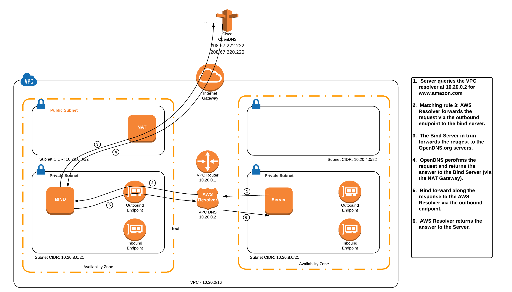
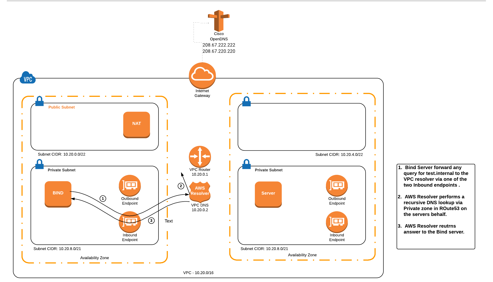

# AWS Reslover

When you create a VPC using Amazon VPC, you automatically get DNS resolution within the VPC from Route 53 Resolver. By default, Resolver answers DNS queries for VPC domain names such as domain names for EC2 instances or ELB load balancers. Resolver performs recursive lookups against public name servers for all other domain names.

## You can also configure DNS resolution between your VPC and your network over a Direct Connect or VPN connection:

## Forward DNS queries from resolvers on your network to Route 53 Resolver

DNS resolvers on your network can forward DNS queries to Resolver in a specified VPC. This allows your DNS resolvers to easily resolve domain names for AWS resources such as EC2 instances or records in a Route 53 private hosted zone. For more information, see How DNS Resolvers on Your Network Forward DNS Queries to Route 53 Resolver.

## Conditionally forward queries from a VPC to resolvers on your network

You can configure Resolver to forward queries that it receives from EC2 instances in your VPCs to DNS resolvers on your network. To forward selected queries, you create Resolver rules that specify the domain names for the DNS queries that you want to forward (such as example.com), and the IP addresses of the DNS resolvers on your network that you want to forward the queries to. If a query matches multiple rules (example.com, apex.example.com), Resolver chooses the rule with the most specific match (apex.example.com) and forwards the query to the IP addresses that you specified in that rule. For more information, see How Route 53 Resolver Forwards DNS Queries from Your VPCs to Your Network.

Like Amazon VPC, Resolver is regional. In each region where you have VPCs, you can choose whether to forward queries from your VPCs to your network (outbound queries), from your network to your VPCs (inbound queries), or both.

## Practical Example

Ideally we want to manage the cloud native environment in the cloud and not rely on changes on prem. However, we also find hybrid is nessasary. We may need to access systems on-prem and vice-versa without making our private DNS zones exposed on the internet. to do both be need to first define the rule of what is handled by the AWS resolver and what we want the resolver to pass on to other DNS systems.

In this use case I want to define these three rule:

1. **.awsamazon.com -> SYSTEM**. Any local VPC request to and hosts in the awsamazon.com domain, I want resolved by the local .2 resolver. This is especially helpful if I use a feature called privatelink that lets me specify endpoints in my local VPC for those services using the services public DNS names. AMazon Key Management System (KMS) is one service that could be used with Privatelink.

1. **.test.local -> SYSTEM**, I want to create a private DNS Zone in AWS Route53 for internal resolution.

## Implementation Instructions

Each of the following sections provides an implementation overview and detailed, step-by-step instructions. The overview should provide enough context for you to complete the implementation if you're already familiar with the AWS Management Console or you want to explore the services yourself without following a walkthrough.

If you're using the latest version of the Chrome, Firefox, or Safari web browsers the step-by-step instructions won't be visible until you expand the section.

### Region Selection

This workshop can be deployed in any AWS region that supports the following services:

AWS Resolver

<strong>Create a VPC (expand for details)</strong>

1. Click the **Launch Stack** link above for the region of your choice.

1. Click **Next** on the Select Template page.

1. Provide a name for the new **VPC** such as `dnsdemo` and click **Next**.
   

1. On the Options page, leave all the defaults and click **Next**.

1. On the Review page click **Create**.

   This template uses a custom resource to copy the static website assets from a central S3 bucket into your own dedicated bucket. In order for the custom resource to write to the new bucket in your account, it must create an IAM role it can assume with those permissions.

1. Wait for the `dnsdemo` stack to reach a status of `CREATE_COMPLETE`.

1. With the `dnsdemo` stack selected, click on the **Outputs** tab. Here you can verify the Subnets that are created for the VPC.

### Standard DNS operations

Let's take a look at how EC2 operated normally

1. Look at VPC DHCP configuration

1. Use Session Manager to access Server

1. verify DNS Server by running cat /etc/resolv.conf

1. dig www.amazon.com

<strong>Create a Bind DNS EC2 instance in the VPC (expand for details)</strong>

1. Click the **Launch Stack** link above for the region of your choice.

1. Click **Next** on the Select Template page.

1. Provide a name for the new **Bind Server** such as `dnsserver` and the **VPC Name** used in the VPC creation section above, such as `dnsdemo` and click **Next**.
   

1. On the Options page, leave all the defaults and click **Next**.

1. On the Review page, check the box to acknowledge that CloudFormation will create IAM resources and click **Create**.
   

   This template will create an IAM role for the EC2 instance, so that you can use Amazon Systems Manager to access the instance's bash shell without the need of SSH or bastion hosts.

1. Wait for the `dnsserver` stack to reach a status of `CREATE_COMPLETE`.

1. With the `dnsserver` stack selected, click on the **Outputs** tab and note the aws cli command for remote console access.

1. Verify the Wild Rydes home page is loading properly and move on to the next module, [User Management](../2_UserManagement).

### Take a look at the Bind Server

1. Session manager to the Bind Instance

1. Verify that the DNS OS uses .2 resolver. cat /etc/resolv.conf while Bind is using the OpenDNS public nameservers on the internet for its querys

1. dig www.zapos.com @127.0.0.1 while dig www.example.test @127.0.0.1 does not work

1. dig www.zappos.com and dig www.example.com does work

1. lets setup logging on the bind server. rndc querylog. tail -f /var/messages

1. using another window connect to the server via session manager and issue a dns query

1. verify there is no log entry since the server is using the .2 resolver and we have not associated a rule to forward requests to the bind server. In the next step we will associate the rules and verify that our external queries go through the Bind Server Instance.

<strong>Configure Endpoints and Rules</strong>

1. Click the **Launch Stack** link above for the region of your choice.

1. Click **Next** on the Select Template page.

1. Provide a name for the **AWS Resolver Endpoint** such as `dnsresolver` and the **VPC Name** used in the VPC creation section above, such as `dnsdemo` and click **Next**.
   

1. On the Options page, leave all the defaults and click **Next**.

1. On the Review page, check the box to acknowledge that CloudFormation will create IAM resources and click **Create**.
   

   This template will create an IAM role for the EC2 instance, so that you can use Amazon Systems Manager to access the instance's bash shell without the need of SSH or bastion hosts.

1. Wait for the `dnsserver` stack to reach a status of `CREATE_COMPLETE`.

1. With the `dnsserver` stack selected, click on the **Outputs** tab and note the aws cli command for remote console access.

1. Verify the Wild Rydes home page is loading properly and move on to the next module, [User Management](../2_UserManagement).

